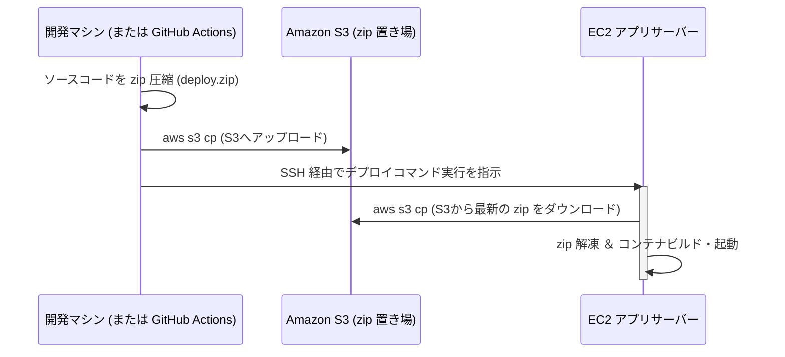

# AWS Production デプロイガイド

本プロジェクトの Next.js アプリケーションを AWS 上で本番運用（Production）するための構築手順とデプロイ自動化の解説です。

---

## 🏗 1. インフラ構成の概要

Terraform を利用して、以下の 2 つの構成をフラグ 1 つで自動構築・切り替えが可能です。

### 構成 2: EC2 + RDS (PostgreSQL) — デフォルト

- **VPC / ネットワーク**:
  - `10.0.0.0/16` の VPC
  - パブリックサブネット×2、プライベートサブネット×2
  - **CIDR 設計**:
    - Public Subnet 1: `10.0.0.0/24`
    - Public Subnet 2: `10.0.1.0/24`
    - Private Subnet 1: `10.0.128.0/24`
    - Private Subnet 2: `10.0.129.0/24`
- **セキュリティグループ**:
  - EC2: インターネット（`0.0.0.0/0`）からの HTTP（`80`）および SSH（`22`）を許可。
  - RDS: EC2 セキュリティグループからの PostgreSQL（`5432`）接続のみを許可。
- **データベース (RDS)**:
  - `db.t4g.micro`（PostgreSQL 16.3）をプライベートサブネットに配置。
- **EC2 インスタンス**:
  - `t3.micro`（Ubuntu 24.04 LTS）をパブリックサブネット 1 に配置。
  - IAM インスタンスプロファイル（`LabInstanceProfile`）をアタッチし、S3 からのファイル取得権限を付与。
  - User Data により **2GB の Swap 領域**、および Docker, Docker Compose, AWS CLI, unzip を自動セットアップ。
  - EC2 起動時に S3 バケットから自動でソースコード（`deploy.zip`）をダウンロードして展開・起動するロジックを内包。
- **S3 バケット (デプロイ用)**:
  - ソースコード zip を保管するためのバケット（バケット名衝突回避のためランダムサフィックス付き）を自動生成。

### 構成 4: ALB + EC2 + RDS (PostgreSQL) — 高可用構成

- `enable_alb = true` に設定することで有効化されます。
- **Application Load Balancer (ALB)**:
  - パブリックサブネットに配置され、インターネットからの HTTP トラフィックを受け付けます。
- **セキュリティグループの強化**:
  - EC2 は直接インターネットから HTTP を受け付けず、**ALB からの HTTP トラフィックのみ**を受け付けるようにセキュリティグループが自動で制限されます。
- **ターゲットグループ**:
  - ALB 宛のトラフィックを EC2 インスタンス（ポート `80`）へ転送します。

---

## 🚀 2. ソースコードのデプロイ方式（S3 経由プルデプロイ）

本システムは、セキュアかつ自動化しやすい **「S3 を経由したデプロイ方式（プッシュ＆プル型）」** を採用しています。

### デプロイの流れ



1. 開発マシン（または GitHub Actions）で、不要なファイルを除外してソースコードを `deploy.zip` として圧縮。
2. 作成された zip を AWS S3 にアップロード。
3. SSH 経由で EC2 インスタンスに対してデプロイの指示を送信。
4. EC2 側が自身に付与された IAM ロール権限を使って S3 から最新の `deploy.zip` をプル（ダウンロード）し、展開して Docker Compose を再起動します。

---

## 🔑 3. 事前準備

AWS リソースを操作するために、以下の準備を行ってください。

### AWS 認証情報の更新 (AWS Academy を使う場合)

AWS Academy のセッションは一定時間（通常 4 時間）で切れるため、操作前に必ず最新の認証情報をセットする必要があります。

1. AWS Academy のコンソールを開き、「**AWS Details**」から「**AWS CLI**」の接続情報をコピーします。

2. 開発環境の `~/.aws/credentials` を開き、`[morijyobi-2026-devops]` プロファイルを作成または更新します。

   ```ini
   [morijyobi-2026-devops]
   aws_access_key_id = ASIA...
   aws_secret_access_key = ...
   aws_session_token = IQoJb3JpZ2luX2Vj...
   ```

### SSH 鍵の配置

1. AWS Academy で自動付与される SSH 秘密鍵（通常は `labsuser.pem`）をローカルマシンの `~/.ssh/labsuser.pem` に配置します。

2. または、他のパスに置く場合はデプロイ時に引数でパスを指定します（例: `./deploy.sh ~/path/to/key.pem`）。

---

## 🏁 4. ローカルからのデプロイ方法 (自動タスク)

`mise.toml` にインフラ構築とアプリデプロイの自動タスクを定義しています。

### 構成 2 (EC2 + RDS) のデプロイ手順

デフォルト（構成 2）のままインフラを構築してデプロイします。

```bash
# 1. Terraform の初期化
mise run aws:init

# 2. インフラの自動構築 (S3, RDS と EC2 を作成)
mise run aws:apply

# 3. アプリケーションのデプロイ (圧縮、S3アップロード、EC2展開をすべて自動で行います)
mise run aws:deploy
```

### 構成 4 (ALB + EC2 + RDS) への移行手順

すでに構成 2 が動いている状態、または最初から構成 4 をデプロイしたい場合は、`terraform.tfvars` ファイルを `terraform` ディレクトリ配下に作成し、変数を上書きします。

1. `terraform/terraform.tfvars` ファイルを作成し、以下を記述します。

   ```hcl
   enable_alb   = true
   rds_password = "YourCustomSecurePassword!" # 必要に応じて変更可能
   ```

2. 変更を適用します。

   ```bash
   # ALB やターゲットグループが追加され、EC2のセキュリティグループルールが自動更新されます
   mise run aws:apply
   ```

   ```bash
   # アプリケーションを再度デプロイ（または更新）します
   mise run aws:deploy
   ```

---

## 🧹 不要になったら（クリーンアップ）

```bash
# 作成した AWS リソース（VPC、EC2、RDS、ALB、S3等）をすべて自動削除します
mise run aws:destroy
```

---

## 🤖 5. GitHub Actions によるデプロイ自動化 (CI/CD)

GitHub リポジトリから自動で AWS へのインフラ構築およびデプロイを行うためのワークフロー [aws-deploy.yml](file:///.github/workflows/aws-deploy.yml) を設定しています。

### 設定手順

GitHub リポジトリの **Settings > Secrets and variables > Actions** にて、以下の Repository Secrets を登録します。

| Secret 名 | 説明 |
| :--- | :--- |
| `AWS_ACCESS_KEY_ID` | AWS Academy から取得したアクセスキーID |
| `AWS_SECRET_ACCESS_KEY` | AWS Academy から取得したシークレットキー |
| `AWS_SESSION_TOKEN` | AWS Academy から取得したセッションキー（一定時間で更新が必要） |
| `AWS_EC2_SSH_KEY` | `labsuser.pem`（秘密鍵）のテキスト内容そのまま |

### 実行方法

1. GitHub リポジトリの **Actions** タブを開きます。

2. 左メニューから **AWS Production Deploy** を選択します。

3. **Run workflow** ボタンをクリックし、Terraform Action（`apply` / `plan` / `destroy` / `none`）を選択して実行します。

   - `apply`: インフラの構築・更新を行ったのち、最新のアプリを S3 経由で EC2 に自動デプロイします。
   - `none`: インフラは更新せず、S3 を経由してアプリのデプロイのみを実行します。
   - `destroy`: インフラをすべて削除します。
